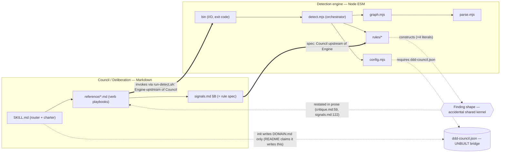

# Critique — 2026-06-18

*Target: whole repo (the ddd-council plugin, run on itself). Lens: strategic ·
critique · workshop. Detector did not run — it targets Rust; this repo is
Markdown + Node, and there is no root `ddd-council.json`. The room read the code
directly; every claim cites a file.*

## De-facto context map

Both large contexts match intent and are internally clean:
- **Detection engine** — strict layered pipeline `bin → detect → {config, graph→parse, rules}`
  ([detect.mjs:1-3](../cli/src/detect.mjs#L1-L3), [graph.mjs:1-5](../cli/src/graph.mjs#L1-L5)).
  No cycles, no leaks, `parse.mjs` isolated behind one seam ([parse.mjs:1-2](../cli/src/parse.mjs#L1-L2)).
- **Council / Deliberation** — all verb playbooks hang off [SKILL.md](../skills/ddd-council/SKILL.md)
  and the shared [signals.md](../skills/ddd-council/reference/signals.md) catalog.

All findings live at the **seam between them**, where DOMAIN.md hopefully placed a
third "Context configuration" context. That candidate does not survive the code.

## Drift table

| Intended (DOMAIN.md / docs) | Observed (code) | Verdict |
|---|---|---|
| Council / Deliberation context | Cohesive; verbs off SKILL.md | ✓ match |
| Detection engine context | Clean layered pipeline, no internal smells | ✓ match |
| "Context configuration" 3rd context (`json` ⇄ `DOMAIN.md`) | No binding code; halves owned separately, nothing connects them | ✗ not a context — an unbuilt seam (①) |
| Finding shape = "shared kernel" (candidate) | Shared kernel confirmed — accidental, 7 sites, no owner | ⚠ drift-prone (②) |
| `init` → `critique` happy path | Breaks at config load on Rust repos | ✗ drift (①) |

## Findings

### ① [HIGH] Drift — `DOMAIN.md → ddd-council.json` generation is documented but unbuilt
- **Where:** [cli/README.md:48](../cli/README.md#L48) claims "*`/ddd-council init` can
  generate this from `DOMAIN.md`*"; [init.md output](../skills/ddd-council/reference/init.md#L52-L78)
  emits only `DOMAIN.md`; [critique.md:38-46](../skills/ddd-council/reference/critique.md#L38-L46)
  requires the file; [config.mjs:30-35](../cli/src/config.mjs#L30-L35) throws without it.
- **Why it matters:** the documented happy path `init → critique` breaks on the only
  language the engine supports. The "Context configuration" context is vapour —
  named in docs, absent in code.
- **Operator ruling (canon):** not deliberate — *"didn't know."* This is real drift.
- **Suggested move (R①):** add a `ddd-council.json` emit step to `init` (it already
  has contexts→paths from its scan; `publicModules` defaults to `["api"]`), gated to
  detector-supported repos; and correct README:48 to match what ships. Shapes as a
  translation `DOMAIN.md (intent) → ddd-council.json (detector input contract)`.

### ② [MEDIUM] Accidental shared kernel — the `Finding` shape, replicated across 7 sites
- **Where:** constructed as object literals in
  [leaky-boundary.mjs:10-23](../cli/src/rules/leaky-boundary.mjs#L10-L23),
  [god-module.mjs:26-38](../cli/src/rules/god-module.mjs#L26-L38),
  [circular-dependency.mjs:51-60](../cli/src/rules/circular-dependency.mjs#L51-L60),
  [cross-context-coupling.mjs:17-28](../cli/src/rules/cross-context-coupling.mjs#L17-L28);
  re-asserted in [bin:57-62](../cli/bin/ddd-council-detect.mjs#L57-L62); described in prose at
  [critique.md:59](../skills/ddd-council/reference/critique.md#L59) and
  [signals.md:122-124](../skills/ddd-council/reference/signals.md#L122-L124).
- **Why it matters:** two contexts contractually bound to one model with no single
  definition or owner — the highest-coupling relationship, created by accident. Already
  drifting: code uses `signalId`/`suggestedMove`; the spec writes `signal-id`/`suggested-move`.
  (The tool that detects accidental shared kernels has one.)
- **Operator ruling (canon):** name it now.
- **Suggested move (R②):** add [cli/src/finding.mjs](../cli/src/finding.mjs) — a `finding()`
  factory + `@typedef Finding` as the single source of truth; rules call it; signals.md and
  critique.md cite it by path instead of restating fields. 7 restatements → 1 definition + pointers.

### ③ [LOW] Unnamed partnership — Council and Detector are each other's upstream
- **Where:** [signals.md:6-9](../skills/ddd-council/reference/signals.md#L6-L9) makes the
  catalog the engine's rule spec (Council upstream); [critique.md:59-65](../skills/ddd-council/reference/critique.md#L59-L65)
  + [run-detect.sh](../skills/ddd-council/scripts/run-detect.sh) consume/invoke the engine
  (Detector upstream). Bidirectional upstream = **partnership** (must change together).
- **Why it's LOW:** nothing breaks; the §B-only mechanization is declared roadmap, not drift
  ([signals.md:20-100](../skills/ddd-council/reference/signals.md#L20-L100) §A/§C are prose).
- **Operator ruling (canon):** in scope.
- **Suggested move (R③):** one note in signals.md naming the partnership, with §B +
  `finding.mjs` as its contract surface and §A/§C marked council-only until mechanized.

## Relationships named (teaching residue)

- **Shared kernel** — model two contexts share and must change together; safe only with one
  owner + one definition. Finding ② is a kernel (both halves are bound to the shape) but
  *accidental* (replicated, unowned). R② promotes it to a published kernel.
- **Partnership** — two contexts each upstream of the other; they evolve in lockstep.
  Finding ③ is the Council↔Detector partnership; its contract surface is signals.md §B +
  the `Finding` kernel.
