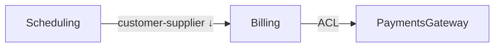

# Verb: map

*Mode: design · Lens: strategic · Reads: intent (`DOMAIN.md` + notes), optionally the repo as a sanity check.*

## Purpose

Generate a **context map** from intent — the bounded contexts, their subdomain
classification, and the named relationships between them. This is the *design*
counterpart to `critique`: `map` draws what the architecture *should* be; `critique`
reports what the code *is*.

## Room framing

- **Architect** leads — proposes the contexts and the seams, argues which is *core*.
- **Domain expert(s)** test each context against the real field — does this
  boundary match how the work is actually divided?
- **User** keeps it honest — walk a concrete end-to-end action and see which
  contexts it crosses.
- **Engineer** sanity-checks feasibility and dependency direction.

## How it runs

1. **Gather candidate contexts** from `DOMAIN.md` and any notes. If a repo is
   present, cross-check against its module structure (but intent leads here).
2. **Walk a scenario or two** end-to-end to expose which contexts collaborate and
   where the boundaries actually fall.
3. **Classify** each context: core (argue for it), supporting, generic.
4. **Name every relationship** using the standard patterns (see `boundaries.md`):
   shared kernel · customer–supplier · conformist · anti-corruption layer ·
   open-host service · published language · partnership · separate ways. Mark
   direction (upstream → downstream).
5. **Pause for the operator** on any boundary the room can't settle.

## Output — `docs/context-map.md`

Append, never overwrite. Includes:

- A **Mermaid `flowchart`** of contexts and named, directed relationships.
- A **prose run-through** beneath it (the diagram is a language test — names must
  be ubiquitous-language names).
- A short table: context → subdomain type (core/supporting/generic) → one-line
  responsibility.

````

````

> *Run-through:* Scheduling is upstream of Billing (it decides what's billable);
> Billing wraps the external PaymentsGateway behind an anti-corruption layer so
> the gateway's vocabulary never leaks inward.

## Guardrails

- Strategic before tactical — don't drift into aggregates here.
- If a context's name strains, the boundary is wrong; rename or re-draw.
- A relationship with no direction is unfinished — every edge names who's upstream.
